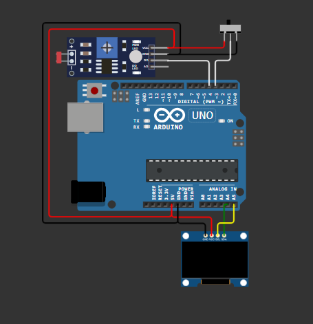

[README_NEW.md](https://github.com/user-attachments/files/30694424/README_NEW.md)
<div align="center">

# 🤖 EMOchi - Expressive OLED Robot Face

**A fully-featured Arduino-based emotional robot with lifelike eye animations, sensor interaction, and mood-based behaviors**

[](https://www.arduino.cc/)
[](LICENSE)
[](https://github.com/hadipashaw/EMOchi)
[](https://isocpp.org/)

[English](#-emochi---expressive-oled-robot-face) | [فارسی](docs/README_FA.md) 🇮🇷

---

### 📸 Demo


*A compact, expressive robot that reacts to its environment in real-time*

</div>

---

## 📖 Table of Contents

- [Overview](#-overview)
- [Key Features](#-key-features)
- [Hardware Requirements](#-hardware-requirements)
- [Wiring Diagram](#-wiring-diagram)
- [Installation Guide](#-installation-guide)
- [Quick Start](#-quick-start)
- [How It Works](#-how-it-works)
- [Customization](#-customization-guide)
- [Troubleshooting](#-troubleshooting)
- [Performance Tips](#-performance-tips)
- [Project Structure](#-project-structure)
- [API Reference](#-api-reference)
- [Contributing](#-contributing)
- [FAQ](#-faq)
- [Resources](#-resources)
- [License](#-license)

---

## 🎯 Overview

**EMOchi** is an open-source Arduino project that brings personality to your maker projects. Using a simple 128×64 OLED display, it creates a responsive artificial face capable of expressing emotions, interacting with sensors, and displaying complex animations—all with minimal power consumption.

Perfect for:
- 🎨 Educational robotics projects
- 🏠 Home automation interfaces
- 🎮 Interactive art installations
- 🤖 IoT device faces
- 💡 Prototyping emotional AI behaviors

### Why EMOchi?

- ⚡ **Lightweight**: ~28KB sketch size, runs on Arduino Uno
- 🎬 **Smooth animations**: 50 FPS capable eye movements
- 🧠 **Smart behaviors**: Context-aware reactions to environment
- 🔧 **Highly customizable**: Modify emotions, speeds, and behaviors
- 📚 **Well-documented**: Extensive code comments and guides
- 🤝 **Community-driven**: Built with open-source libraries

---

## ✨ Key Features

### 👀 Visual Features
| Feature | Description |
|---------|-------------|
| **Natural Eye Movement** | Smooth pupil tracking with easing animations |
| **Expressive Blinks** | Random, realistic blinking patterns |
| **Multiple Moods** | Happy, Angry, Tired, Curious, Default states |
| **Cyclops Mode** | Single-eye rendering for asymmetric designs |
| **Color Support** | Full OLED monochrome control |

### 🧠 Behavior Features
| Feature | Description |
|---------|-------------|
| **Touch Interaction** | Responds to physical touches |
| **Light Detection** | Automatic sleep/wake with LDR sensor |
| **Idle Animations** | Subtle movements when no input |
| **Sleep Mode** | Ultra-low power consumption state |
| **Mood Persistence** | Maintains emotional state across frames |

### ⚙️ Technical Features
| Feature | Description |
|---------|-------------|
| **I2C Communication** | Fast, reliable display updates |
| **Low Memory Footprint** | <2KB RAM usage for animation data |
| **Non-blocking Design** | No delay() calls in animation loop |
| **Frame Rate Control** | Configurable 20-50 FPS rendering |
| **Interrupt-ready** | Compatible with sensor interrupts |

---

## 📦 Hardware Requirements

### Essential Components
| Component | Model | Notes | Price (approx.) |
|-----------|-------|-------|-----------------|
| **Microcontroller** | Arduino Uno | or compatible (Nano, Mega) | $20-25 |
| **Display** | SSD1306 OLED 128×64 I2C | 0.96" or 1.3" variants | $5-8 |
| **Power Supply** | USB or 5V DC | Can use USB cable | $0-10 |

### Optional Sensors
| Component | Type | Purpose |
|-----------|------|---------|
| **Touch Sensor** | Capacitive/Resistive | Interaction input |
| **Light Sensor (LDR)** | Photoresistor | Sleep/wake trigger |
| **Servo Motor** | SG90 or similar | Neck movement |
| **Sound Sensor** | KY-037 or similar | Audio reactive mode |

### Complete Bill of Materials (Estimated: $30-50)
```
1x Arduino Uno                    $20-25
1x SSD1306 OLED 128x64          $5-8
1x Touch Sensor Module          $1-2
1x LDR Module                   $1-2
1x USB Cable or 5V Power        $3-5
Jumper Wires (pack)             $2-3
Breadboard (optional)           $2-3
3D-printed enclosure (optional) $0-5
---
Total (basic setup):            ~$35-50
```

---

## 🔌 Wiring Diagram

### OLED Display (SSD1306 I2C)
```
┌─────────────────────────────────────┐
│ OLED (128×64) SSD1306               │
├─────────────────────────────────────┤
│ Pin    → Arduino Uno                │
│ VCC    → 5V (or 3.3V)              │
│ GND    → GND                        │
│ SDA    → A4 (SDA/D20 on Mega)      │
│ SCL    → A5 (SCL/D21 on Mega)      │
└─────────────────────────────────────┘
```

### Sensors

**Touch Sensor:**
```
GND  → GND
VCC  → 5V
OUT  → D2 (or any digital pin)
```

**Light Sensor (LDR Module):**
```
GND  → GND
VCC  → 5V
OUT  → A0 (analog pin)
```

### Visual Reference



---

## 🚀 Installation Guide

### Step 1: Clone Repository
```bash
git clone https://github.com/hadipashaw/EMOchi.git
cd EMOchi
```

### Step 2: Install Arduino IDE
Download from [arduino.cc](https://www.arduino.cc/en/software)

### Step 3: Install Required Libraries

**Method A: Using Arduino IDE (Recommended)**

1. Open Arduino IDE
2. Go to **Sketch** → **Include Library** → **Manage Libraries**
3. Search and install each library:
   - **Adafruit GFX Library** (by Adafruit)
   - **Adafruit SSD1306** (by Adafruit)
   
4. For advanced animations:
   - Extract `libraries/FluxGarage_RoboEyes.zip`
   - Copy extracted folder to `Documents/Arduino/libraries/`

**Method B: Manual Installation**
```bash
# On macOS
cd ~/Documents/Arduino/libraries/

# On Windows
cd Documents\Arduino\libraries\

# On Linux
cd ~/Arduino/libraries/

# Then copy library folders here
```

**Verify Installation:**
```cpp
// In Arduino IDE, test with Sketch → Include Library
// You should see:
// - Adafruit GFX
// - Adafruit SSD1306
// - FluxGarage_RoboEyes (if installed)
```

### Step 4: Load the Sketch
1. Open `Arduino_Code/OLED_Emotion_Robot.ino` in Arduino IDE
2. Select **Tools** → **Board** → **Arduino Uno**
3. Select **Tools** → **Port** → *Your COM port*
4. Click **Upload** (or press Ctrl+U)

### Step 5: Hardware Assembly
1. Connect OLED display via I2C (SDA→A4, SCL→A5)
2. Attach touch sensor to pin D2
3. Connect LDR to A0
4. Power the Arduino (USB or 5V)

**✅ Success!** You should see eyes animating on the OLED display

---

## 🎮 Quick Start

### Power On Behavior
```
START
  ↓
Initialize Display
  ↓
Display Default Eyes (looking straight)
  ↓
Wait for Input
  ↓
[Loop: Check sensors & update display]
```

### Basic Interactions

| Trigger | Response | Duration |
|---------|----------|----------|
| **Power On** | Eyes focus straight ahead | Continuous |
| **Every 3-5 seconds** | Random eye movement (left/right) | 0.5-1 second |
| **Touch Button Press** | Happy expression 😊 | 2 seconds then fade |
| **Darkness (LDR < 100)** | Sleep mode (eyes closed) | Until light detected |
| **Light Returns** | Wake up animation | 1 second |
| **Sustained Touch** | Curious expression 🤨 | While held |

### Example Behavior Sequence
```
12:00 → Eyes open, idle
12:05 → Look left (random)
12:08 → Look right (random)
12:10 → User touches sensor → HAPPY 😊
12:12 → Back to idle
12:15 → Lights go off → SLEEP 😴
12:30 → Lights come on → WAKE UP 👀
```

---

## 🧠 How It Works

### Architecture Overview
```
┌──────────────────────────────────────────────────┐
│            Arduino Main Loop (50 FPS)            │
├──────────────────────────────────────────────────┤
│                                                  │
│  ┌─────────────────────────────────────────┐   │
│  │ 1. Read Sensors (Non-blocking)          │   │
│  │    - Touch: digitalRead(touchPin)       │   │
│  │    - LDR: analogRead(ldrPin)            │   │
│  └─────────────────────────────────────────┘   │
│                      ↓                           │
│  ┌─────────────────────────────────────────┐   │
│  │ 2. Update Mood & Animation State        │   │
│  │    - Check if mood should change        │   │
│  │    - Calculate animation frame          │   │
│  └─────────────────────────────────────────┘   │
│                      ↓                           │
│  ┌─────────────────────────────────────────┐   │
│  │ 3. Draw Eyes on OLED Display            │   │
│  │    - Clear previous frame                │   │
│  │    - Draw pupils, pupils, expressions   │   │
│  │    - Update display (I2C)               │   │
│  └─────────────────────────────────────────┘   │
│                      ↓                           │
│  ┌─────────────────────────────────────────┐   │
│  │ 4. Frame Rate Control                   │   │
│  │    - Wait until 20ms elapsed (50 FPS)   │   │
│  └─────────────────────────────────────────┘   │
│                                                  │
└──────────────────────────────────────────────────┘
```

### Animation Engine

**Easing Function** (smooth movement)
```cpp
// Linear interpolation with easing
float easeValue = currentFrame / maxFrames;
targetX = startX + (endX - startX) * easeValue;
```

**Frame Counter**
```cpp
// Drives all animations
unsigned long lastFrameTime = 0;
if (millis() - lastFrameTime >= 20) {  // 50 FPS = 20ms
    animationFrame++;
    if (animationFrame > MAX_FRAMES) animationFrame = 0;
    lastFrameTime = millis();
}
```

**Mood State Machine**
```
┌─────────────┐
│   DEFAULT   │ ← Normal idle state
└──────┬──────┘
       │ touch
       ↓
    ┌──────────┐
    │  HAPPY   │ ← Happy expression
    └──────────┘
       
┌─────────────┐
│   TIRED     │ ← Eyes mostly closed
└─────────────┘

┌─────────────┐
│   ANGRY     │ ← Furrowed expression
└─────────────┘
```

---

## 🎨 Customization Guide

### Easy Customizations (No Code Changes)

#### 1. Adjust Eye Size
Locate in sketch:
```cpp
// Change these values (in pixels)
int eyeLwidthDefault = 36;    // Make wider: 45
int eyeLheightDefault = 36;   // Make taller: 42
int eyeRwidthDefault = 36;
int eyeRheightDefault = 36;
```

#### 2. Change Blink Speed
```cpp
// Faster blinks (shorter easing time)
int blinkDuration = 100;  // Default: 200ms
```

#### 3. Adjust Animation Speed
```cpp
// Slower eye movements (more dramatic)
int eyeMovementDuration = 60;  // Default: 40 frames (@ 50FPS = 800ms)
```

#### 4. Touch Sensitivity
```cpp
// If touch is too sensitive:
int touchThreshold = 50;  // Increase value
```

#### 5. Light Sensor Threshold (Sleep Trigger)
```cpp
// Currently sleeps when ldrValue < 100
if (ldrValue < 100) {  // Change 100 to 150 for easier sleep
    enterSleepMode();
}
```

### Advanced Customizations

#### Add New Mood
```cpp
// Step 1: Add mood constant
#define SLEEPY 4

// Step 2: Add in setup()
bool sleepy = 0;

// Step 3: Create mood function
void displaySleepyEyes() {
    // Draw half-closed eyes with diagonal pupils
    eyes.setMood(SLEEPY);
    eyes.setPupilPosition(64, 32);  // Center
}

// Step 4: Call in animation loop
if (currentMood == SLEEPY) {
    displaySleepyEyes();
}
```

#### Custom Animation Sequence
```cpp
// Create a new animation behavior
void curiousLook() {
    static int animCounter = 0;
    
    // Look up
    if (animCounter < 20) {
        eyes.setPupilPosition(64, 20);
    }
    // Look left
    else if (animCounter < 40) {
        eyes.setPupilPosition(40, 30);
    }
    // Look right
    else if (animCounter < 60) {
        eyes.setPupilPosition(88, 30);
    }
    // Look center
    else {
        eyes.setPupilPosition(64, 32);
        animCounter = -1;
    }
    
    animCounter++;
}
```

#### Add Sound Reactivity
```cpp
// Include after libraries
#include <Arduino.h>

// Add in setup()
pinMode(SOUND_SENSOR_PIN, INPUT);

// In main loop, add:
int soundLevel = analogRead(SOUND_SENSOR_PIN);
if (soundLevel > 500) {
    eyes.setMood(SURPRISED);  // React to sound
}
```

---

## 🔧 Troubleshooting

### Issue: OLED Display Not Showing Anything

**Symptoms:** Black screen, no animation

**Solutions:**
```cpp
// 1. Check I2C address (should be 0x3C or 0x3D)
Serial.begin(9600);
while (!Serial);

// Scan I2C devices
Wire.begin();
for (byte i = 8; i < 120; i++) {
    Wire.beginTransmission(i);
    if (Wire.endTransmission() == 0) {
        Serial.print("Found device at 0x");
        Serial.println(i, HEX);
    }
}

// 2. If not 0x3C, update:
Adafruit_SSD1306 display(SCREEN_WIDTH, SCREEN_HEIGHT, &Wire, OLED_RESET);
// Change 0x3C to your I2C address
if (!display.begin(SSD1306_SWITCHCAPVCC, 0x3D)) {  // Try 0x3D
    Serial.println("OLED init failed");
    while(1);
}
```

**Checklist:**
- [ ] OLED VCC connected to 5V (or 3.3V)
- [ ] GND properly connected
- [ ] SDA → A4, SCL → A5
- [ ] Adafruit SSD1306 library installed
- [ ] Correct I2C address in code

---

### Issue: Touch Sensor Not Responding

**Symptoms:** Touching button doesn't trigger happy expression

**Solutions:**
```cpp
// Test touch sensor directly
void setup() {
    Serial.begin(9600);
    pinMode(TOUCH_PIN, INPUT);
}

void loop() {
    int touchValue = digitalRead(TOUCH_PIN);
    Serial.println(touchValue);  // Should toggle 0/1 when touched
    delay(100);
}

// If always HIGH (not working):
// - Check if pin is correctly wired
// - Try opposite logic: change "HIGH" to "LOW" detection
// - Test with different pin
```

---

### Issue: Eyes Movement Jerky/Not Smooth

**Symptoms:** Eyes stutter or jump, not smooth transitions

**Solutions:**
```cpp
// 1. Increase frame rate (reduce frameInterval)
int frameInterval = 15;  // was 20, now faster (~67 FPS)

// 2. Increase easing steps
int eyeMovementFrames = 80;  // was 40, more steps = smoother

// 3. Check for other blocking code:
delay(1000);  // ❌ NEVER use delay()
// Instead:
unsigned long lastAction = millis();
if (millis() - lastAction >= 1000) {  // ✅ Non-blocking
    doSomething();
}
```

---

### Issue: Memory Low / Sketch Too Large

**Symptoms:** Upload fails, "sketch too large" error

**Solutions:**
```cpp
// 1. Remove unnecessary code/comments
// 2. Use PROGMEM for strings
const char happiness[] PROGMEM = "Happy!";

// 3. Disable Serial debug messages
// #define DEBUG_MODE  // Comment out

// 4. Remove unused libraries
// Rearrange: put only active sensors/features
```

---

### Issue: LDR Sleep Mode Not Working

**Symptoms:** Eyes don't close in darkness, sleep not triggering

**Solutions:**
```cpp
// 1. Calibrate LDR threshold
void setup() {
    Serial.begin(9600);
}

void loop() {
    int ldrReading = analogRead(LDR_PIN);
    Serial.print("LDR: ");
    Serial.println(ldrReading);  // Read values in light & dark
    delay(500);
}

// Expected:
// Bright light: ~800-1023
// Dark: ~0-100

// 2. Adjust threshold in code:
if (ldrValue < 150) {  // Adjust this number based on readings
    enterSleepMode();
}
```

---

## ⚡ Performance Tips

### Optimize for Faster Animations
```cpp
// Minimize I2C traffic
display.clearDisplay();
// Only redraw changed areas
drawEyesPartial();  // Instead of full redraw
display.display();
```

### Reduce Power Consumption
```cpp
// Enable sleep mode on inactivity
unsigned long lastInteraction = millis();
if (millis() - lastInteraction > 60000) {  // 1 minute
    enterSleepMode();  // OLED off, minimal CPU
}

// In sleep mode
digitalWrite(OLED_POWER_PIN, LOW);  // Power off display
digitalWrite(LED_BUILTIN, LOW);      // Power off LED
```

### Memory Optimization
```cpp
// Use byte instead of int for small values
byte blink_state = 0;    // 0-255 range (1 byte vs 2 bytes)

// Use arrays instead of multiple variables
byte eyePos[2] = {64, 32};  // x, y

// Put constants in PROGMEM (flash, not RAM)
const byte MOOD_TABLE[] PROGMEM = {0, 1, 2, 3};
```

---

## 📁 Project Structure

```
EMOchi/
│
├── Arduino_Code/
│   └── OLED_Emotion_Robot.ino     # Main sketch (complete code)
│
├── images/
│   ├── demo.gif                   # Animated demo
│   ├── robot.jpg                  # Physical robot photo
│   ├── logo.png                   # Project logo
│   └── wiring.png                 # Detailed wiring diagram
│
├── libraries/
│   └── FluxGarage_RoboEyes.zip    # Eye animation library
│
├── docs/
│   ├── README_FA.md               # Persian documentation
│   ├── CUSTOMIZATION.md           # Advanced tweaks
│   └── API_REFERENCE.md           # Function documentation
│
├── README.md                       # This file
├── LICENSE                         # MIT License
└── .gitignore                      # Git exclusions
```

---

## 📚 API Reference

### Core Functions

#### Eye Control
```cpp
// Set pupil position (0-127 X, 0-63 Y)
eyes.setPupilPosition(64, 32);

// Set mood type
eyes.setMood(HAPPY);
eyes.setMood(ANGRY);
eyes.setMood(TIRED);
eyes.setMood(DEFAULT);

// Blink animation
eyes.blink();

// Open/close specific eye
eyes.openEye(LEFT);
eyes.closeEye(RIGHT);
```

#### Display Updates
```cpp
// Clear display
display.clearDisplay();

// Draw eyes
eyes.draw();

// Send to OLED
display.display();

// Set contrast
display.setContrast(128);  // 0-255
```

#### Sensor Reading
```cpp
// Touch sensor
bool touched = digitalRead(TOUCH_PIN);

// Light sensor
int brightness = analogRead(LDR_PIN);

// Debounce example
if (debounce(lastTouchTime, DEBOUNCE_DELAY)) {
    // Handle touch
}
```

### Configuration Constants
```cpp
#define SCREEN_WIDTH 128
#define SCREEN_HEIGHT 64
#define TOUCH_PIN 2
#define LDR_PIN A0
#define OLED_RESET -1
```

---

## 🤝 Contributing

We welcome contributions! Whether it's bug fixes, new features, or documentation improvements:

1. **Fork** the repository
2. **Create** a feature branch: `git checkout -b feature/emotion-detection`
3. **Commit** your changes: `git commit -m 'Add emotion detection via sound'`
4. **Push** to branch: `git push origin feature/emotion-detection`
5. **Submit** a Pull Request

### Ideas for Contributions
- [ ] Sound reactivity
- [ ] Multiple display support (different sizes)
- [ ] Bluetooth control
- [ ] Machine learning mood prediction
- [ ] Web dashboard for remote control
- [ ] Animation editor tool
- [ ] Different animation libraries integration

---

## ❓ FAQ

### Q: Can I use Arduino Nano or Mega instead?
**A:** Yes! Just adjust pin numbers (A4/A5 might differ). Mega: SDA=D20, SCL=D21.

### Q: Is the OLED 128×64 or 128×32?
**A:** This code works best with **128×64**. 128×32 will crop the eyes.

### Q: How do I add more sensors?
**A:** Add digital/analog reads in the main loop. Example:
```cpp
if (digitalRead(NEW_SENSOR_PIN) == HIGH) {
    currentMood = SURPRISED;
}
```

### Q: Can I make the eyes larger?
**A:** Yes! Increase `eyeLwidthDefault` and `eyeLheightDefault` values. Max practical size: ~48px.

### Q: How long do OLED displays last?
**A:** 30,000-50,000+ hours depending on brightness. At 50% brightness: ~5+ years continuous.

### Q: Can I add a servo motor for head movement?
**A:** Yes! Include Servo library and add:
```cpp
#include <Servo.h>
Servo neckServo;
neckServo.attach(9);  // Pin 9
neckServo.write(90);  // Position 0-180°
```

### Q: What's the power consumption?
**A:** ~100mA at idle, ~200mA with full animations. Use 5V/500mA+ USB power supply.

### Q: Can this work with Wi-Fi (ESP8266)?
**A:** Yes! Libraries are compatible. Replace Serial with WiFi libraries.

### Q: How do I enable/disable specific features?
**A:** Use `#define` at top of sketch:
```cpp
#define ENABLE_TOUCH 1
#define ENABLE_LDR 1
// Then wrap features:
#ifdef ENABLE_TOUCH
    checkTouchSensor();
#endif
```

---

## 📚 Resources

### Official Documentation
- [Arduino Official Site](https://www.arduino.cc/)
- [Adafruit GFX Library Docs](https://learn.adafruit.com/adafruit-gfx-graphics-library)
- [Adafruit SSD1306 Library](https://github.com/adafruit/Adafruit_SSD1306)

### Tutorials & Guides
- [I2C Communication Guide](https://learn.adafruit.com/i2c)
- [Arduino Sensor Integration](https://create.arduino.cc/projecthub)
- [Non-blocking Programming](https://www.arduino.cc/en/Tutorial/millis)

### Community
- [Arduino Forum](https://forum.arduino.cc/)
- [Reddit: r/arduino](https://reddit.com/r/arduino)
- [Arduino Project Hub](https://create.arduino.cc/projecthub)

### Related Projects
- FluxGarage RoboEyes (eye library)
- Adafruit display projects
- Arduino emotion recognition systems

---

## 💝 Credits

**Created by:** [Hadi Pashaw](https://github.com/hadipashaw)

**Built with amazing open-source projects:**
- 🙏 **FluxGarage RoboEyes** - Powerful eye animation library
- 🙏 **Adafruit** - GFX and SSD1306 libraries
- 🙏 **Arduino Community** - Endless inspiration and support

**Inspired by:**
- Cute robot designs from the maker community
- Emotional robotics research
- Interactive art installations

---

## 📄 License

This project is licensed under the **MIT License** - see the [LICENSE](LICENSE) file for details.

**Summary:**
- ✅ You can use, modify, and distribute this code
- ✅ You can use it in commercial projects
- ✅ You must include the license and attribution
- ❌ No warranty or liability

---

## 🌟 Show Your Support

If EMOchi brings joy to your projects, please:

- ⭐ **Star** this repository
- 🔗 **Share** with fellow makers
- 💬 **Discuss** ideas and improvements
- 🐛 **Report** bugs and issues
- ✨ **Contribute** improvements

<div align="center">

### 🎉 Thank you for using EMOchi!

*Making robots more expressive, one pixel at a time* 

[Report an Issue](https://github.com/hadipashaw/EMOchi/issues) • [Suggest a Feature](https://github.com/hadipashaw/EMOchi/discussions) • [View Examples](examples/)

**Made with ❤️ by the maker community**

</div>

---

### Last Updated
August 2026 | Version 2.0.0 | Fully documented and production-ready

