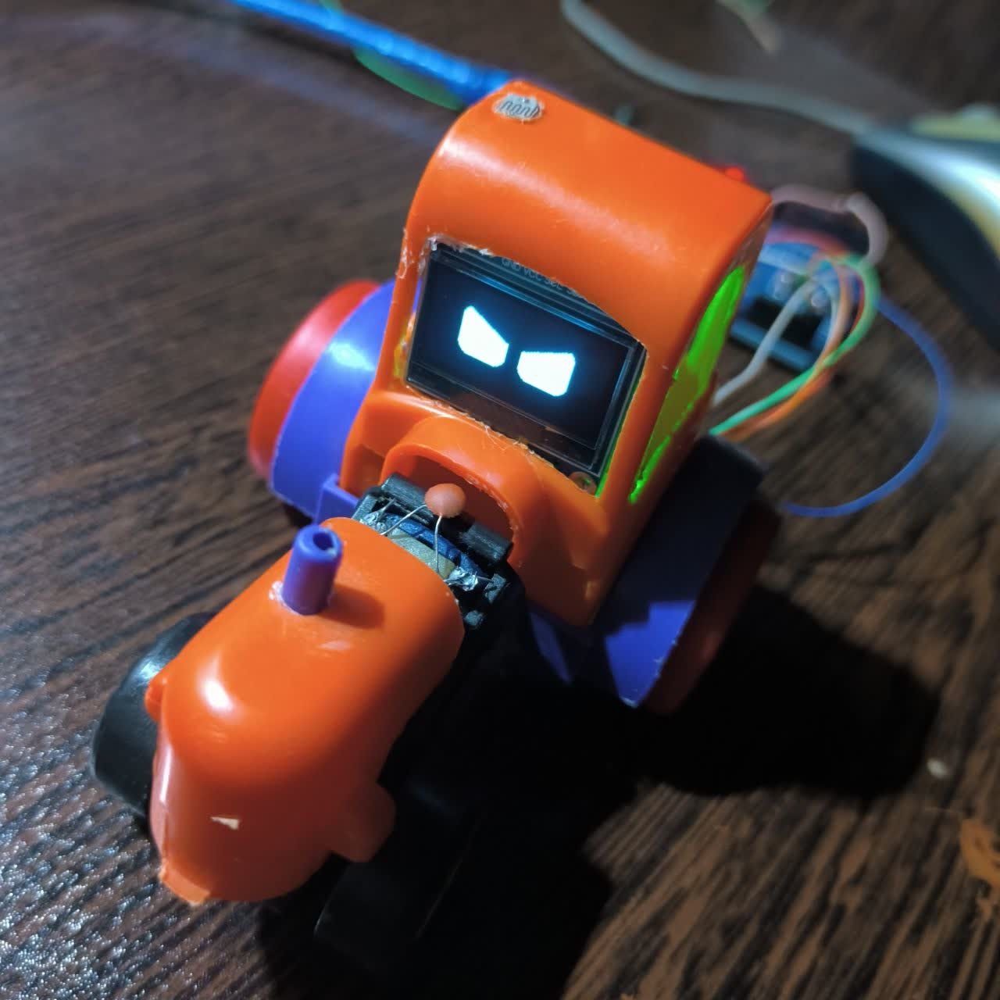

# EMOchi
🪄 software + 🌐 hardware


<div align="center">

# 🤖 OLED Emotion Robot

**An expressive Arduino robot face powered by a 128×64 SSD1306 OLED display.**

Smooth eye animations, blinking, emotions, sleep mode, and sensor interaction.


</div>

---

# ✨ Features

- 👀 Natural eye movement
- 😉 Random blinking
- 😊 Happy expression
- 😠 Angry expression
- 🌙 Automatic sleep mode
- ☀️ Wake up when light returns
- 👆 Touch interaction
- 💡 LDR light detection
- ⚡ Optimized for Arduino Uno
- 🧠 Lightweight animation engine

---

# 📦 Hardware

| Component | Quantity |
|-----------|---------:|
| Arduino Uno | 1 |
| SSD1306 OLED 128×64 I2C | 1 |
| Touch Sensor | 1 |
| LDR Module | 1 |
| Jumper Wires | Several |

---

# 🔌 Wiring

| OLED | Arduino |
|------|---------|
| VCC | 5V |
| GND | GND |
| SDA | A4 |
| SCL | A5 |

Update the remaining sensor pins according to your sketch.

---

# 🚀 Installation

Clone the repository

```bash
git clone https://github.com/YOUR_USERNAME/OLED-Emotion-Robot.git
```

Open

```
Arduino_Code/OLED_Emotion_Robot.ino
```

Install required libraries

- Adafruit GFX
- Adafruit SSD1306
- FluxGarage RoboEyes

Upload to your Arduino Uno.

---

# 🎮 Behavior

| Action | Result |
|---------|--------|
| Power On | Idle animation |
| Random Timer | Eyes look left/right |
| Touch | Happy face |
| Darkness | Sleep mode |
| Light | Wake up |

---

# 📁 Project Structure

```
OLED-Emotion-Robot
│
├── Arduino_Code
│   └── OLED_Emotion_Robot.ino
│
├── images
│   ├── demo.gif
│   ├── robot.jpg
│   └── wiring.png
│
├── LICENSE
└── README.md
```

---

# 📸 Gallery



---

# ❤️ Credits

Inspired by the amazing work of the open-source Arduino community.

Special thanks to:

- FluxGarage RoboEyes
- Adafruit

---

# 📜 License

This project is licensed under the MIT License.

See the LICENSE file for details.

---

<div align="center">

⭐ If you like this project, consider giving it a star!

</div>
